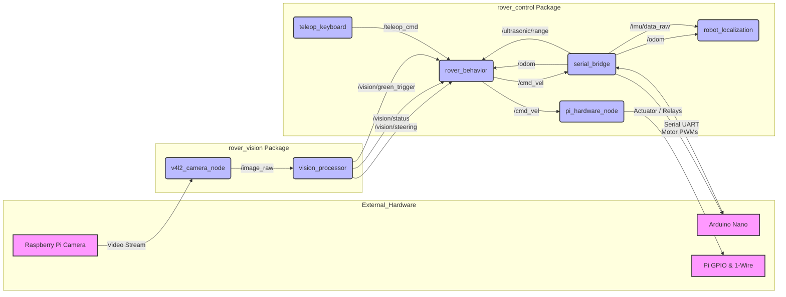

# Autonomous Soil Analysis Rover (ROS 2 Jazzy)

An autonomous platform designed for precision agriculture/remote exploration, integrating computer vision, sensor fusion, and soil health monitoring.

## System Architecture
* **Compute:** Raspberry Pi 4B (ROS 2 Jazzy)
* **Low-Level Control:** Arduino Nano (via Serial Bridge)
* **Navigation:** Extended Kalman Filter (EKF) fusing Encoder and IMU data via `robot_localization`.
* **Vision:** OpenCV-based line tracking for autonomous row navigation.
* **Actuation:** BTS7960 High-current drivers for linear soil-probing actuator.

## Core Packages
* `rover_control`: Hardware interface, Mother Node (behavior tree logic), and telemetry.
* `rover_vision`: Image processing and spatial detection.
* `nano_firmware`: C++ firmware for the Arduino hardware interface.

## Setup
1. Clone to `~/rover_ws/src`
2. Run `colcon build --cmake-args -DBUILD_TESTING=OFF`
3. `source install/setup.bash`
4. `ros2 launch rover_control rover_bringup.launch.py`

## License
Proprietary - All Rights Reserved.

(This project is Proprietary. Personal use for learning and hobbyist experimentation is encouraged. See LICENSE.txt for full terms.)

